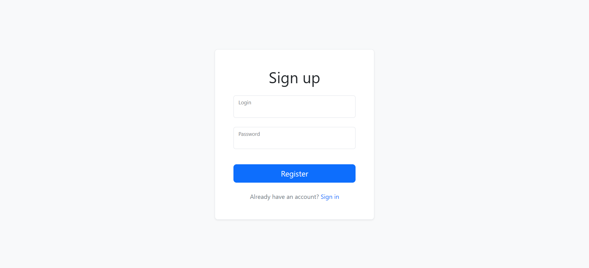
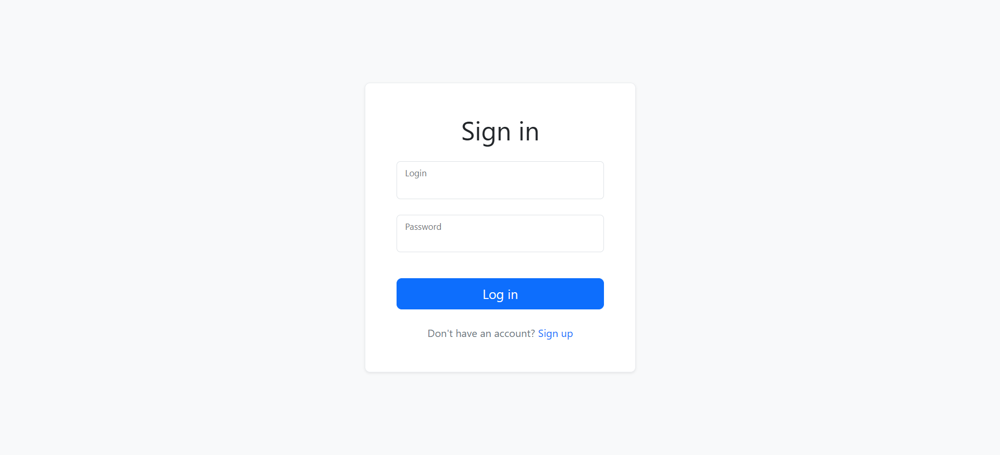
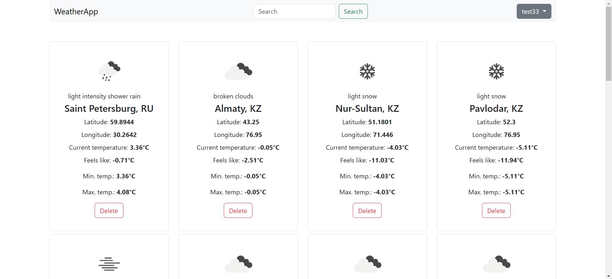
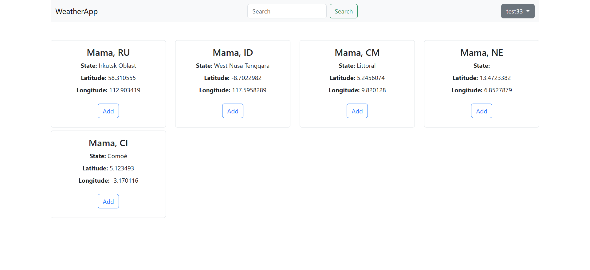

<h1 align='center'>
Weather app project
</h1>

## Overview
This web application allows users to track the current weather in multiple locations.  
After signing up, users can add locations to their collection and view real-time weather updates on the main page. 
The app fetches weather data from the OpenWeatherMap API.

## Key features
- add/remove locations;
- search for locations by name
- user registration, authentication, and logout
- real-time weather data from OpenWeatherMap API;
- automatic session cleanup with a scheduled task;
- database migrations for schema management

## Technologies Used
- **Backend:** Spring MVC, Hibernate ORM, Lombok
- **Frontend:** Thymeleaf, Bootstrap 5
- **Database:** PostgresSQL 16, Flyway
- **Testing:** JUnit 5, Mockito
- **Build Tool:** Maven

## Database

#### Table `Users`

<table>
    <tr>
        <th>Column</th>
        <th>Type</th>
        <th>Description</th>
    </tr>
    <tr>
        <td>ID</td>
        <td>Int</td>
        <td>Auto Increment, Primary Key</td>
    </tr>
    <tr>
        <td>Login</td>
        <td>Varchar</td>
        <td>Username or email, Unique</td>
    </tr>
    <tr>
        <td>Password</td>
        <td>Varchar</td>
        <td>BCrypt-encrypted password</td>
    </tr>
</table>

#### Table `Locations`
<table>
    <tr>
        <th>Column</th>
        <th>Type</th>
        <th>Description</th>
    </tr>
    <tr>
        <td>ID</td>
        <td>Int</td>
        <td>Auto Increment, Primary Key</td>
    </tr>
    <tr>
        <td>Name</td>
        <td>Varchar</td>
        <td>Location name</td>
    </tr>
    <tr>
        <td>UserId</td>
        <td>Int</td>
        <td>User who added this location</td>
    </tr>
    <tr>
        <td>Latitude</td>
        <td>Decimal</td>
        <td>Location latitude</td>
    </tr>
    <tr>
        <td>Longitude</td>
        <td>Decimal</td>
        <td>Location longitude</td>
    </tr>
</table>

#### Table `Sessions`
<table>
    <tr>
        <th>Column</th>
        <th>Type</th>
        <th>Description</th>
    </tr>
    <tr>
        <td>ID</td>
        <td>Varchar</td>
        <td>Session ID, GUID, primary key</td>
    </tr>
    <tr>
        <td>UserId</td>
        <td>Int</td>
        <td>The user for whom the session was created</td>
    </tr>
    <tr>
        <td>ExpiresAt</td>
        <td>Datetime</td>
        <td>Session expiration time. Equal to 24 hours</td>
    </tr>
</table>

## Screenshots

<figure style="text-align: center;">
  
  <figcaption>Registration page</figcaption>
</figure>
<figure style="text-align: center;">
  
  <figcaption>Login page</figcaption>
</figure>
<figure style="text-align: center;">
  
  <figcaption>Locations page</figcaption>
</figure>

<figure style="text-align: center;">
  
  <figcaption>Searched locations page</figcaption>
</figure>

## Project Insights
- Implemented session management with automatic cleanup
- Used Thymeleaf parameterized fragments for reusable UI components
- Integrated OpenWeatherMap API for real-time weather updates
- Applied Flyway for database schema migrations
- Developed authentication filters for secure access
- Wrote integration tests with JUnit and Mockito  
